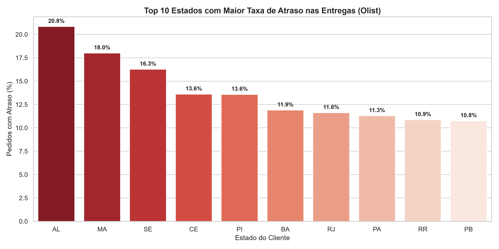

# 🚚 Análise de Performance Logística e Impacto Financeiro — E-commerce Olist

Análise exploratória desenvolvida em Python a partir do dataset público da Olist, com foco na identificação de gargalos logísticos, análise de atrasos de entrega e avaliação de possíveis impactos financeiros relacionados ao frete.

## 📌 Contexto do Projeto

Em operações de e-commerce, o desempenho das entregas pode influenciar diretamente a experiência do cliente.

Neste projeto, foi utilizado o dataset público da Olist para realizar uma análise dos dados de pedidos, explorando informações relacionadas a prazo de entrega, localização dos clientes e valores de frete.

O trabalho envolve etapas de preparação, limpeza, integração e análise dos dados, buscando transformar os dados brutos em informações que possam facilitar a identificação de padrões e gargalos logísticos.

## 🛠️ Tecnologias e Ferramentas

* **Python 3.12**
* **Pandas** — limpeza, manipulação, cruzamento de tabelas (`merge`) e agregações (`groupby`)
* **NumPy** — operações e tratamento numérico
* **PyCharm** — ambiente de desenvolvimento
* **Git/GitHub** — versionamento e gerenciamento do projeto

## 📈 Principais Análises

### 1. Gargalos de entrega por estado

A análise dos dados identificou diferenças relevantes nas taxas de atraso entre os estados brasileiros.

Alagoas apresentou uma taxa de atraso de **20,8%**, com tempo médio de espera de aproximadamente **24 dias** no conjunto analisado.

### 2. Comparação do desempenho logístico

O Rio de Janeiro apresentou uma taxa de atraso de **11,6%**, ocupando a 7ª posição entre os estados analisados, enquanto o frete médio observado foi de **R$ 20,91**.

A comparação permite investigar diferenças de desempenho logístico mesmo entre regiões com características geográficas distintas.

### 3. Relação entre atraso e frete

Na análise realizada, pedidos com atrasos superiores a 50 dias apresentaram frete médio de **R$ 27,82**, enquanto entregas consideradas normais apresentaram média de **R$ 19,90**.

Isso representa uma diferença média de aproximadamente **39,8%** no valor do frete entre os dois grupos analisados.

## 📊 Visualização dos Dados

O projeto também conta com visualizações destinadas a facilitar a identificação dos estados com maiores taxas de atraso.



## 📁 Estrutura do Repositório

```text
📦 portfolio_olist_ecommerce
├── 📄 limpeza_dados.py
├── 📁 data
│   └── 📊 grafico_top10_atrasos.png
├── 📁 dados
├── 📄 .gitignore
└── 📄 README.md
```

### `limpeza_dados.py`

Script responsável pelas etapas de preparação e análise dos dados utilizadas no projeto.

### `.gitignore`

Configuração utilizada para evitar o envio de arquivos de dados pesados ou que não precisam fazer parte do repositório.

## 🎯 Objetivo

Este projeto foi desenvolvido como parte dos meus estudos em Python e análise de dados, buscando praticar manipulação de dados, exploração de informações e interpretação de indicadores logísticos.

O objetivo principal é transformar dados públicos em análises que permitam compreender melhor o comportamento das entregas e identificar possíveis pontos de atenção na operação.
